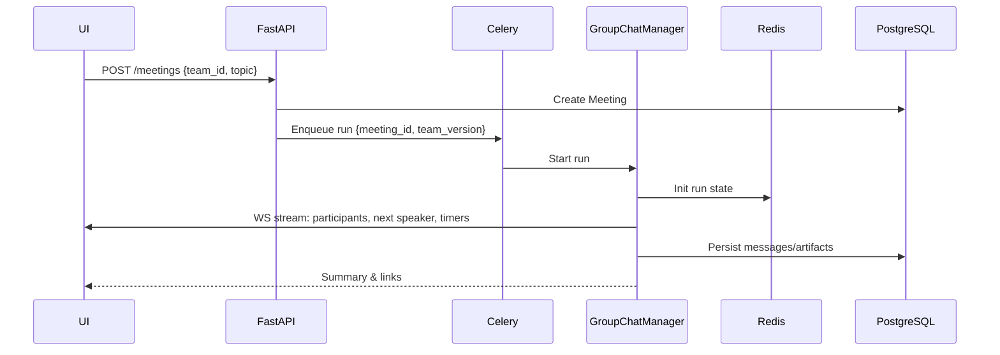
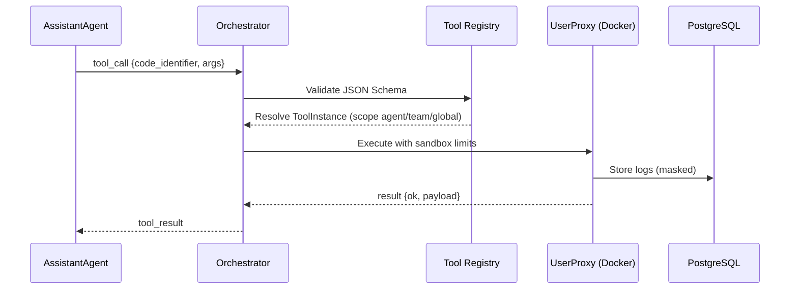

# Архитектурный документ XIO: Консилиум экспертов на базе AutoGen v0.4

Версия: 1.1  
Дата: [Текущая дата]  
Автор: Профессиональный архитектор ПО  

Этот документ представляет собой подробный архитектурный план проекта XIO, основанный на спецификации из "@XIO_ at_AutoGen v0.4.md" и дополненный требованиями из `CHAT_dop.md` и `CHAT_UI_dop.md`. Он охватывает архитектуру, стек, взаимодействия, события WS, модели данных и UX‑аспекты чатового интерфейса.

## 1. Общая архитектура сервиса

XIO — мультиагентная система для управляемых консилиумов экспертов, автоматизирующая поток: подготовка → обсуждение → фиксация решений → задачи → фоллоу‑ап. Архитектура agent‑first, service‑oriented и stateless с акцентом на безопасность и наблюдаемость.

### Основные компоненты:
- **Team (Команда)**: Декларативная конфигурация состава агентов, их ролей, привязок инструментов и политик консенсуса. Представление в AutoGen как `GroupChat`. Версионируется, фиксируется на `run`.
- **Оркестратор (GroupChatManager)**: На базе AutoGen AgentChat; политики очередности (`round_robin`, `auto`, `random`, `custom`), FSM/StateFlow и проверки качества (min_alternatives, rationale, risk_cost).
- **Агенты (AssistantAgent)**: Роли — Модератор, Доменные эксперты, Хронист, Интегратор.
- **UserProxyAgent**: Безопасное исполнение кода/инструментов в Docker с лимитами CPU/RAM/NET/timeout; точки вмешательства пользователя.
- **Инструменты (Tools)**: `ToolDefinition` (системная сигнатура + JSON Schema) и `ToolInstance` (экземпляр пользователя: параметры/секреты/права). Подписи для LLM и реальное исполнение через UserProxy.
- **Интеграции**: Notion (decision log, tasks), Slack/Telegram (резюме/фоллоу‑апы), RAG (ChromaDB), браузинг (Crawl4AI/Browser‑use), трекеры (Jira/Linear — этап 2+).
- **WS‑слой**: Брокер событий и сериализаторы для чатового UX; стрим `StreamEvent` в UI (участники, сообщения, треды инструментов, артефакты, статус run).
- **Хранилища**: PostgreSQL (история, конфиги, артефакты/метрики), Redis (живое состояние run), ChromaDB (векторный индекс).
- **Backend**: FastAPI (REST/WS), Celery + Redis/RabbitMQ (очереди и воркеры run/instrument).
- **UI/Панель модератора**: React + TypeScript + shadcn/ui + Radix + Tailwind; левая панель участников, правая лента с тредами инструментов и артефактами, виртуализация, модерация.
- **Наблюдаемость/Безопасность**: OTel трассинг, метрики, аудит, маскирование секретов, лимиты токенов/стоимости.

### 1.1. Team (состав, политики, версии)
- Состав: агенты (роль, системный промпт, модель, доступные инструменты), веса/приоритеты экспертов.
- Политики: критерии завершения (альтернативы, rationale, риск/стоимость), `allow_repeat_speaker`, лимит итераций/таймбоксы.
- Дефолты: `speaker_selection_method`, лимиты токенов/стоимости, интеграции.
- Версионирование: `team_version` фиксируется на `run`; новая версия при изменениях.
- Привязка инструментов: `ToolInstance` на уровнях scope `agent|team|global` с разрешением `agent → team → global`.

### 1.2. Tools (модель и жизненный цикл)
- ToolDefinition: `definition_id|code_identifier`, `name`, `description`, `json_schema` входа, `returns`, `runtime_constraints`, `network_policy`, `visibility (ce|ee)`.
- ToolInstance: `instance_id`, `definition_id`, `owner_id`, `parameters`, `secrets_ref`, `scope`, `permissions`, `rate_limits`.
- Поток вызова: ассистент → оркестратор (валидация JSON Schema) → резолв ToolInstance → UserProxy (Docker sandbox) → логирование/маскирование → ответ агенту/UI.
- Безопасность: strict JSON Schema, песочница, маскирование, idempotency‑ключи (например, `meeting_id`).

### Взаимодействие компонентов
- UI создаёт Meeting на базе Team → Backend ставит run в очередь → Оркестратор управляет диалогом и событиями → UserProxy выполняет инструменты → Интегратор экспортирует в Notion → Коммуникации рассылаются в Slack/Telegram.
- Состояние run в Redis; история/артефакты в PostgreSQL; релевантный контекст через ChromaDB.

## 2. Технологический стек

- Языки: Python (AutoGen, backend), TypeScript (UI).
- Фреймворки: AutoGen v0.4 (Core/AgentChat/Studio), FastAPI (REST/WS), Celery + Redis/RabbitMQ, React + Vite, shadcn/ui + Radix + Tailwind.
- Хранилища: PostgreSQL, Redis, ChromaDB.
- Инфраструктура: Docker (песочница), WebSockets, OTel/Prometheus/ELK.
- Интеграции: Notion, Slack/Telegram, Crawl4AI/Browser‑use, Jira/Linear (этап 2+).

## 3. Взаимодействие между сервисами и модулями

- Протоколы: HTTP/REST, WebSockets (WS события), AMQP/Redis Streams (очереди), gRPC (опц., ee внутренняя шина).
- Форматы: JSON (API), JSON Schema (инструменты), Markdown (контент сообщений/решений), NDJSON (логи событий).

### 3.1. API Meetings/Run
- POST `/api/v1/meetings` → создать Meeting `{ team_id, topic, agenda, config_override }` → `{ id }`.
- POST `/api/v1/meetings/{id}/start` → запустить run → `{ run_id }`.
- WS  `/api/v1/meetings/{id}/stream` → поток `StreamEvent`.
- POST `/api/v1/meetings/{id}/control` → `{ action: pause|resume|stop|handoff|request_alt|request_risk, to? }`.

### 3.2. API Teams
- CRUD `/api/v1/teams`, GET `/api/v1/teams/{id}/config`, POST `/api/v1/teams/{id}/import/studio`.

### 3.3. API Tools
- GET `/api/v1/tools/available` (реестр `ToolDefinition`).
- CRUD `/api/v1/tool-definitions` (admin/ee), CRUD `/api/v1/tool-instances` (owner‑scoped), GET `/api/v1/agents/{id}/tools`.

### 3.4. API для чатового UX
- GET `/api/v1/meetings/{id}/messages?page=…` — пагинация истории ленты.
- GET `/api/v1/meetings/{id}/participants` — состав и текущие статусы участников.
- POST `/api/v1/meetings/{id}/messages` — (опц.) пользовательские комментарии/вопросы.

### 3.5. WS события и сериализация
- Тип `StreamEvent` — объединение: `participant_updated | chat_message | tool_call | artifact | run_status`.
- Политики сериализации: не инлайнить секреты; аргументы инструментов маскируются; тред инструментов — отдельная сущность, сообщения могут ссылаться на `thread_id`; idempotency на клиенте по `id/thread_id+status`.

Примеры событий:
```json
{ "type": "chat_message", "payload": {"id":"msg_123","run_id":"run_1","agent_id":"a_exp1","role":"assistant","content":"...","created_at":"...","reply_to":null} }
```
```json
{ "type": "tool_call", "payload": {"thread_id":"tc_55","status":"running","tool_id":"notion.decision_log","agent_id":"a_integr","args_masked":{"meeting_id":"..."},"progress":{"step":2,"total":3}} }
```
```json
{ "type": "artifact", "payload": {"kind":"decision_log","meeting_id":"m_1","page_id":"notion:...","url":"https://notion.so/...","summary":"Решение №3 утверждено","created_at":"..."} }
```

## 4. Диаграммы

### 4.1. Архитектура высокого уровня
```mermaid
graph TD
    A[Пользователь UI] -->|API/WS| B[FastAPI Backend]
    B -->|Async Job| C[Celery Workers]
    C -->|Run| D[AutoGen Оркестратор]
    D -->|Messages| E[Агенты: Moderator, Experts, Scribe, Integrator]
    E -->|Tool Calls| F[UserProxy (Docker Sandbox)]
    F -->|Integrations| G[Notion/Slack/Other]
    D -->|State| H[Redis]
    D -->|History| I[PostgreSQL]
    E -->|RAG| J[ChromaDB]
    B -->|Admin| K[Tool Registry]
    B -->|WS| L[WS Broker/Serializers]
```

### 4.2. Последовательность: запуск консилиума


### 4.3. Последовательность: вызов инструмента


## 5. Требования к производительности, масштабируемости и отказоустойчивости

- Производительность: среднее время до решения ≤ 15 мин; подготовка повестки ≤ 7 мин; WS‑latency < 250 мс; валидация инструментов < 10 мс; контроль стоимости/лимитов токенов.
- Масштабируемость: горизонтальное масштабирование воркеров; sticky routing по `meeting_id`; backpressure и квоты; шардинг Redis/ChromaDB (этап 2+).
- Отказоустойчивость: идемпотентность интеграций по `meeting_id`; ретраи; сетевые allowlists; бэкапы PostgreSQL; health‑checks; circuit breaker на внешние API.

## 6. Деплоймент и интеграции

- Деплой: Kubernetes (Deployments для API/Workers, StatefulSets для PostgreSQL/Redis/ChromaDB), HPA; секреты через KMS/External Secrets; CI/CD (GitHub Actions), миграции (Alembic).
- Интеграции: Notion/Slack (MVP), далее Jira/Linear/Calendar как новые `ToolDefinition` + шаблоны `ToolInstance`.

## 7. Безопасность и соответствие

- Песочница: Docker с лимитами CPU/RAM/NET/timeout, read‑only FS, отдельные образы классов инструментов.
- Секреты: `secrets_ref` (Vault/KMS), маскирование в логах, ротация.
- Доступы: уровни к Meetings/Teams/ToolInstances; аудит действий; политики приватности.
- Политики качества: проверка перед финализацией (решение ↔ задачи ↔ дедлайны).

## 8. Модель данных (уточнённая)

- `teams(id, version, name, config, consensus_policy, defaults, created_by, created_at)`
- `agents(id, team_id, role, model, system_prompt, weights)`
- `agent_tools(agent_id, tool_instance_id)`
- `tool_definitions(definition_id, name, description, json_schema, returns, runtime_constraints, network_policy, visibility)`
- `tool_instances(instance_id, definition_id, owner_id, scope, parameters, secrets_ref, permissions, rate_limits)`
- `meetings(id, team_id, team_version, topic, agenda, status)`
- `runs(id, meeting_id, started_at, finished_at, cost_tokens, status)`
- `messages(id, run_id, agent_id, role, content_md, reply_to, tool_call_thread_id, created_at)`
- `tool_call_threads(id, meeting_id, run_id, tool_id, agent_id, status, args_masked jsonb, logs jsonb, result_summary jsonb, created_at)`
- `participants_snapshot(id, meeting_id, payload jsonb, created_at)`
- `artifacts(id, meeting_id, type, payload jsonb, external_ref, url, created_at)`
- `audit_logs(id, actor, action, entity, entity_id, payload, created_at)`

Связи: `teams 1..N agents`, `agents N..N tool_instances`, `meetings 1..N runs`, `runs 1..N messages`, `runs 1..N tool_call_threads`.

## 9. UX/Design‑system (UI)

- Дизайн‑система: shadcn/ui + Radix + Tailwind, семантические токены (colors/typography/space/motion), CSS variables, `ThemeProvider` (light/dark/brand), WCAG AA.
- Chat UI: `ParticipantsSidebar` (speaking/next/tool badges, контекстные действия), `ConversationPane` (виртуализация, markdown, mentions), `ToolCallThread` (стадии, прогресс, masked args), `ArtifactCard` (Decision Log/Task), `ModeratorPanel` (run control, таймеры, прогресс консенсуса), уведомления (toasts/banners).
- Клиентские сервисы: REST/WS клиенты с reconnect/backoff/heartbeat; store (Zustand/RTK) с батч‑обновлениями и мемоизацией селекторов.

## 10. CE vs EE (Open‑Core)

- CE: базовый Orchestrator, Teams/Meetings, Tools, WS‑стрим, чатовый UX, Redis/PostgreSQL/Chroma, базовые метрики и аудит.
- EE: SSO, расширенный RBAC/org, политический движок (OPA) для селектора/консенсуса, квоты/лимиты на run/инструменты, приватный marketplace инструментов, расширенная наблюдаемость (OTel traces/metrics), внутренняя gRPC‑шина, data residency.

## 11. Принципы XIO

- Agent‑First; Service‑Oriented & Stateless; Tool‑Centric & Secure.